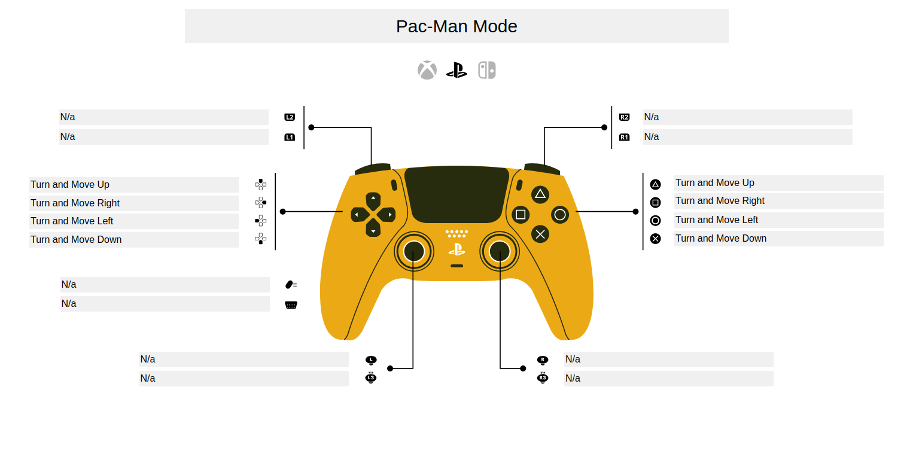
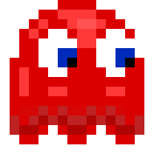
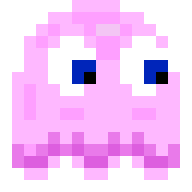
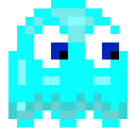
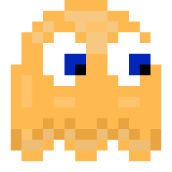

*This project has been created as part of the 42 curriculum by pfreire-, rmedeiro*

# Pac-Man 3D

A faithful-ish recreation of the classic 80s arcade game

---

## Description

Pac-Man is an arcade, top-down maze runner where your hero, Pac-Man, must eat all pacdots in an inescapable maze while running away from mean ghosts.

# Instructions

Compile the game using `make` and run it as follows:

```bash
./cub3d ./path/to/map.cub [debug_mode=y] [XX]
```

- The game must receive a map file with a `.cub` extension.  
- If you wish to run in Debug Mode, include the flag `debug_mode=y`.  
- `XX` is the number of the event corresponding to your controller.

You may find this number by running `cat /proc/bus/input/devices` in your terminal while your controller is connected, then locating a section like:

```bash
I: Bus=0005 Vendor=054c Product=09cc Version=8100
N: Name="Wireless Controller"
...
H: Handlers=event24 [<- This number] js0  
```

In this example, you'd run:  
`./cub3d /path/to/map.cub 24`

*The game was only tested with a DualShock 4, but any standard Linux-compatible controller should work.*

# Resources

## Useful Links

- [The Pac-Man Dossier](https://pacman.holenet.info/)
- [Pinky's and Inky's Behaviour](http://www.donhodges.com/pacman_pinky_explanation.htm)
- [Pac-Man's Ghost AI Explained (YouTube)](https://youtu.be/ataGotQ7ir8?si=lzHnfo73AK_7L9Mr)
- [How Frightened Ghosts Decide Where to Go (YouTube)](https://youtu.be/eFP0_rkjwlY?si=0KCkQxVCgE_LzqHW)
- [Pac-Man Kill Screen Explained (YouTube)](https://youtu.be/NKKfW8X9uYk?si=LQhQqmPGesiZVzuQ)
- [Splitting Apart the Split Screen](http://www.donhodges.com/how_high_can_you_get2.htm)

### AI Usage

AI was used exclusively for:
- Debugging aid
- Formating and fixing typos in this README
- Research assistance

# Modes

The game features two modes: **Pac-Man Mode** and **Cub3D Mode**.

- In **Pac-Man Mode**, ghosts will be active, and you'll control Pac-Man using global directions (North, East, West, and South; see the control scheme for details).
- In **Cub3D Mode**, you can explore the maze without ghosts and access some restricted areas.

# Pac-Man Mode

### Run around and eat them all. Just don't get caught!

This is classic Pac-Man. Your objective is simply to eat all the dots in the maze. Ghosts will pursue you. If they touch you, it will hurt. Bigger pellets might allow you to turn the tables on them.

Use the provided file `PacMan.cub` to play on the original map.

## Basics

Ghosts will pursue Pac-Man — except when they don’t. There are 4 possible states: **Chase**, **Scatter**, **Frightened**, and **Eaten**. You can use Debug Mode to see exactly what they do in each state and when they change state.

# Controls

This control scheme was designed for a DualShock 5, but it should work with any Linux-compatible controller.



# Characters

## Pac-Man

Pac-Man is faster than the ghosts in most cases, except when eating pacdots. He can also cut corners: turning a bit early or late, not just at perfect 90-degree angles. Used skillfully, this lets you stay ahead of the ghosts and escape in time.

## Ghosts

### Shadow "Blinky" 
The most aggressive of the ghosts. Blinky pursues Pac-Man directly and is the fastest ghost. He puts pressure on the player, especially when only a few pacdots are left in the maze.

### Speedy "Pinky" 
Pinky works together with Blinky to trap Pac-Man, aiming for 4 tiles in front of the player. Pinky is sure to corner Pac-Man with Blinky's help.

### Bashful "Inky" 
The hardest ghost to predict. Inky uses Blinky's current position along with Pac-Man's to flank him where least expected.

### Pokey "Clyde" 
This ghost is unique. He will pursue Pac-Man directly, but at the last moment, shies away to his corner.

# Cub3D Mode

In this mode, you can look around the map, open gates, and take a nice peaceful stroll.

*The control scheme is again based on the DualShock 5, but should work with any Linux-compatible controller.*


# Custom Map

Both Cub3D and Pac-Man modes allow for custom maps, as long as the map follows these requirements:

## Allowed Characters

- `'1'` — Wall  
- `'0'` — Open space  
- `'.'` — Pac-dot  
- `[N/E/W/S]` — The player starting position and spawn direction  
   (e.g., N = North, E = East, W = West, S = South)
- `'b'` — Blinky's scatter target  
- `'p'` — Pinky's scatter target  
- `'i'` — Inky's scatter target  
- `'c'` — Clyde's scatter target  
  *(Ghosts missing scatter targets will be considered disabled and won't appear during gameplay)*
- `'D'` — Wrap portal

---

### Kill Screen
Theres a little surprise for the players that actually get to level 256. No Spoilers  
Play to find out.  
(Or just cheat and edit the code, I am  README not a cop).

<details>
<summary>Other Info</summary>

### BitMask Catalog

#### BitMask to Tile Catalog

There are two globals that serve as reference tables for creating the bitmask.  
A SpriteSheet is used, each sprite is marked with a unique decimal index, ranging from 0 to 255.

The game checks the 8 nearest neighbors of a tile to determine what it should be. It constructs a unique binary number from the neighboring tiles, in the following order:

- Up,  
- Left,  
- Down,  
- Right,  
- Top-Right Corner,  
- Top-Left Corner,  
- Bottom-Left Corner,  
- Bottom-Right Corner.

For example, given this tile arrangement:

| 1 | 1 | 0 |
|:-:|:-:|:-:|
| 1 | X | 0 |
| 0 | 0 | 0 |

If X is a wall (`1`), you'd get the binary number: **1100 0100**  
(The first four bits are for the cardinal directions, the last four for the diagonals).

If by walls ('1') a single tile can't be selected a disambiguation function will run. It will use a flood fill to see where the player can move and create a new bit mask based on the player accesibility.

Use the tables below to get the appropriate sprite index:

### Wall Reference Table
This Table is the first one used and ti checks walls, if a tile can be selected by walls alone it will be.

| Binary Mask | Hex Value | Index | Description |
|---|---|---:|---|
| 1111 1111 | 0xFF | 39  | Full Tile |
| 0011 0001 | 0x31 | 16  | Top Left Corner|
| 0110 0010 | 0x62 | 18  | Top Right Corner |
| 1001 1000 | 0x98 | 60  | Bottom Left Corner |
| 1100 0100 | 0xC4 | 62  | Bottom Right Corner |
| 1111 1101 | 0xFD | 127 | Reverse Top Right Corner |
| 1111 1110 | 0xFE | 128 | Reverse Top Left Corner |
| 1111 0111 | 0xF7 | 106 | Reverse Bottom Left Corner |
| 1111 1011 | 0xFB | 105 | Reverse Bottom Right Corner |
| 1011 1001 | 0xB9 | 38  | Vertical Left Wall |
| 1011 1011 | 0xBB | 38 | Vertical Left Wall |
| 1011 1101 | 0xBD | 38 | Vertical Left Wall |
| 1011 1111 | 0xBF | 38 | Vertical Left Wall |
| 1110 0110 | 0xE6 | 40 | Vertical Right Wall |
| 1110 1110 | 0xEE | 40 | Vertical Right Wall |
| 1110 0111 | 0xE7 | 40 | Vertical Right Wall |
| 1110 1111 | 0xEF | 40 | Vertical Right Wall |
| 0111 0011 | 0x73 | 17  | Horizontal Top Wall |
| 0111 0111 | 0x77 | 17 | Horizontal Top Wall |
| 0111 1011 | 0x7B | 17 | Horizontal Top Wall |
| 0111 1111 | 0x7F | 17 | Horizontal Top Wall |
| 1101 1100 | 0xDC | 61 | Horizontal Bottom Wall |
| 1101 1110 | 0xDE | 61 | Horizontal Bottom Wall |
| 1101 1101 | 0xDD | 61 | Horizontal Bottom Wall |
| 1101 1111 | 0xDF | 61 | Horizontal Bottom Wall |
| 1110 0010 | 0xE2 | 107 | Reverse Bottom Right Vertical Corner Wall |
| 1011 0001 | 0xB1 | 104 | Reverse Bottom Left Vertical Corner Wall |
| 1011 1000 | 0xB8 | 126 | Reverse Top Left Vertical Corner Wall |
| 1110 0100 | 0xE4 | 129 | Reverse Top RIght Vertical Corner Wall |
| 0111 0001 | 0x71 | 83  | Reverse Top Right Horizontal Corner Wall |
| 0111 0010 | 0x72 | 84  | Reverse Top Left Horizontal Corner Wall |
| 1101 1000 | 0xD8 | 150 | Reverse Bottom Right Horizontal Corner Wall  |
| 1101 0100 | 0xD4 | 151 | Reverse Bottom Left Horizontal Corner Wall |


### Void Reference Table
this Table is the second one and it checks Unnacessible tiles, if a tile cannot be selected by looking at Walls alone this one will be use. If even after this one a tile can't be selected a random glicthed tile will spawn

| Binary Mask | Hex Value | Index | Description |
|---|---|---:|---|
| 1111 1111 | 0xFF | 39 | Full Tile|
| 0000 0100 | 0x04 | 149 | Bottom Right Curved Border |
| 0000 1000 | 0x08 | 148 | Bottom Left Curved Border |
| 0000 0010 | 0x02 | 85 | Top Right Curved Border |
| 0000 0001 | 0x01 | 82 | Top Left Curved Border |
| 1100 1110 | 0xCE | 16 | Top Left Corner |
| 0110 0111 | 0x67 | 60 | Bottom Left Corner |
| 0011 1011 | 0x3B | 62 | Bottom Right Corner |
| 1001 1101 | 0x9D | 18 | Top Left Corner |
| 0100 0110 | 0x46 | 41 | Vertical Wall Right |
| 0100 0100 | 0x44 | 41 | Vertical Wall Right |
| 0100 0001 | 0x41 | 41 | Vertical Wall Right |
| 0100 0000 | 0x40 | 41 | Vertical Wall Right |
| 0001 1001 | 0x19 | 43 | Vertical Wall Left |
| 0001 1000 | 0x18 | 43 | Vertical Wall Left |
| 0001 0001 | 0x11 | 43 | Vertical Wall Left |
| 0001 0000 | 0x10 | 43 | Vertical Wall Left |
| 1000 1100 | 0x8C | 20 | Horizontal Wall Top |
| 1000 1000 | 0x88 | 20 | Horizontal Wall Top |
| 1000 0100 | 0x84 | 20 | Horizontal Wall Top |
| 1000 0000 | 0x80 | 20 | Horizontal Wall Top |
| 0010 0011 | 0x23 | 64 | Horizontal Wall Bottom |
| 0010 0010 | 0x22 | 64 | Horizontal Wall Bottom |
| 0010 0001 | 0x21 | 64 | Horizontal Wall Bottom |
| 0010 0000 | 0x20 | 64 | Horizontal Wall Bottom |
| 1100 1100 | 0xCC | 103 | Left Gate Frame |
| 1001 1100 | 0x9C | 101 | Right Gate Frame |

Below is the Annotated SpriteSheet:  
For each sprite, look at the 8 top-left corner sprites; by counting them as binary, their decimal value represents their index in the struct.  
Since the SpriteSheet is standardized, you only need to encode the first table and multiply the coordinates by a fixed 200x186 vector to get the correct color.


</details>