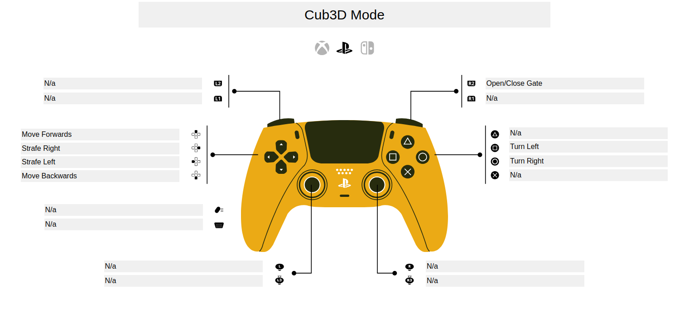

*This proect was something something 42 curriculum by pfreire-, rmedeiro*

# Pac-Man 3D
## A faituful-ish recreating of the classic 80s arcade game

## Description
Pac-Man is a arcade, top down maze runner where your hero, Pac-Man, must eat all pacdots ina inescapable maze while running away from mean ghosts.

# Modes
The game features 2 modes, Pac-Man Mode and Cub3d mode.
In Pac-Man mode the game will be ghosts will be active and you'll control Pac-Man by global directions, based on North, East, West and South (see control scheme for more details). In Cub3d mode will will be able to explore the Maze without the ghostly apparitions and be able to access some restricted areas.

# Instructons
Compile the game using `make`
Run it as so
```bash
./cub3d ./path/to/map.ber [debug_mode=y] [XX]
```

Where the game must receive a map file in a .ber extension. If you wish to run it in Debug Mode you may include the flag "debug_mode=y"
XX is the number of the event corresponding to your controller
You may find this number by running ```cat /proc/bus/input/devices``` in your terminal while your command is connected and find this line

```bash
I: Bus=0005 Vendor=054c Product=09cc Version=8100
N: Name="Wireless Controller"
P: Phys=
S: Sysfs=/devices/virtual/misc/uhid/0005:054C:09CC.0010/input/input39
U: Uniq=84:30:95:10:46:23
H: Handlers=event24 <- This number js0  
B: PROP=0
B: EV=20000b
B: KEY=7fdb000000000000 0 0 0 0
B: ABS=3003f
B: FF=107030000 0
```

The game was only tested with a Dualshock 4 but any standard command should work.


# Pac-Man Mode
### Run around and eathem all. just don't get caught
Classic Pac-Man. Your objective is to simple eat all dots on the maze. The ghosts will pursue you, if you touch them it will hurt. Those bigger pellets might give them a taste fo their own medicine,

Use the provided file original.ber to play on the original map.

## Basics
Ghosts will pursue Pac-Man until they don't. They are 4 possible states: Chase, Scatter, Frightened and Eaten. Using Debug mode you may understand exactly what they do in each state and see when they change their state.

# Controls
This control scheme is made for a Dualshock 5 but it should work with any controller.

# Chracters
## Pac-Man
Pac-Man is faster than the ghosts in most cases, execpt when eating pacdots. Pac-Man has the ability of corner cutting, he can turn in to a corner a bit early or a bit later than exactly 90 degres. When used by a skilled player it can be used to get an edge on the ghosts and run away in time.

## Ghosts
### Shadow "Blinky" 
The most agressive of the ghosts, it pursues Pac-Man directy, it is also the fastest ghost, this agressive little guy will be sure to keep the presure on the player, espeially when few pacdots are left in the maze
### Speedy "Pinky" 
This ghost works directly with Blinky to trap Pac-Man, aiming for 4 tiles in front of the player, Pinky is sure to corner Pac-Man with the help of Blinky
### Bashful "Inky" 
This ghost is the hardest to predict, using Blinky's current possition along with Pac-Man's it will work to flank him where least expected
### Pokey "Clyde" 
This ghost is unique, it will pursue pacman directly but at the last second shy away to it's corner

# Cube3D Mode
In this mode you wil be able to look around the map, open gates and take a nice peaceful stroll.

This control scheme is made for a Dualshock 5 but it should work with any controller.


# Custom Map
Both Cub3D and Pac-Man mode allow for a custom map to be used. As long as the map follows the following requirements

### No Forbidden Characters
The map must contain only expected characters and those are:
'1' - Wall  
'0' - Open Space  
'.' - Pac-dot  

[NEWS] - The player position and to where it spawns looking (e.g. N ->   North, E-> East W-> West, S -> Sounth)

'b' - Blinky's Scatter Target  
'p' - Pinky's Scatter Target  
'i' - Inky's Scatter Target  
'c' - Clyde's Scatter Target  
(Ghosts with missing Scatter Targets will be considered Disabled and will not appear during gameplay)


# Other Info
## BitMask Catalog
### BitMask to Tile Catalog
There are two globals that serve as a reference table for creating the bitmask.
Simply a SpriteSheet is used, on it every sprite is marked witha unique decimal index, ranging from 0 to 255.
The game then checks the 8 nearest neiborgh of a tile to determinate what it should be. It does this by making each tile with a 1 or a 0
Accept the example below
|1|1|0|
|1|X|0|
|0|0|0|
Accept X as the tile we need to find an apropriate sprite for, we kno wthat X is a Wall, so a 1.
We build a unique binary number that represents this tile by flipping bits from the grateast to the smallest following this order:
Up, Left, Down, Right, Top Right Corner, Top Left Corner, Bottom Left Corner, Bottom Right Corner.
In the example we would build the following Binary number: 
1100 0100
The first 4 Bits represent the imediate Cardinal neighbors while the 4 last bits represent the diagonals.
From this number we use the below reference table to find the apropriate index in the SpriteSheet, in this case it would be 62, a bottom right simgle line corner

| Binary Mask | Hexadeciaml Value | SpriteSheet Index | Description |
|---|---|---:|---|
| 1111 1111 | 0xFF | 39  | Full Tile |
| 0011 0001 | 0x31 | 16  | Top Left Corner|
| 0110 0010 | 0x62 | 18  | Top Right Corner |
| 1001 1000 | 0x98 | 60  | Bottom Left Corner |
| 1100 0100 | 0xC4 | 62  | Bottom Right Corner |
| 1111 1101 | 0xFD | 127 | Reverse Top Right Corner |
| 1111 1110 | 0xFE | 128 | Reverse Top Left Corner |
| 1111 0111 | 0xF7 | 106 | Reverse Bottom Left Corner |
| 1111 1011 | 0xFB | 105 | Reverse Bottom Right Corner |
| 1011 1001 | 0xB9 | 38  | Vertical Left Wall |
| 1011 1011 | 0xBB | 38 | Vertical Left Wall |
| 1011 1101 | 0xBD | 38 | Vertical Left Wall |
| 1011 1111 | 0xBF | 38 | Vertical Left Wall |
| 1110 0110 | 0xE6 | 40 | Vertical Right Wall |
| 1110 1110 | 0xEE | 40 | Vertical Right Wall |
| 1110 0111 | 0xE7 | 40 | Vertical Right Wall |
| 1110 1111 | 0xEF | 40 | Vertical Right Wall |
| 0111 0011 | 0x73 | 17  | Horizontal Top Wall |
| 0111 0111 | 0x77 | 17 | Horizontal Top Wall |
| 0111 1011 | 0x7B | 17 | Horizontal Top Wall |
| 0111 1111 | 0x7F | 17 | Horizontal Top Wall |
| 1101 1100 | 0xDC | 61 | Horizontal Bottom Wall |
| 1101 1110 | 0xDE | 61 | Horizontal Bottom Wall |
| 1101 1101 | 0xDD | 61 | Horizontal Bottom Wall |
| 1101 1111 | 0xDF | 61 | Horizontal Bottom Wall |
| 1110 0010 | 0xE2 | 107 | Reverse Bottom Right Vertical Corner Wall |
| 1011 0001 | 0xB1 | 104 | Reverse Bottom Left Vertical Corner Wall |
| 1011 1000 | 0xB8 | 126 | Reverse Top Left Vertical Corner Wall |
| 1110 0100 | 0xE4 | 129 | Reverse Top RIght Vertical Corner Wall |
| 0111 0001 | 0x71 | 83  | Reverse Top Right Horizontal Corner Wall |
| 0111 0010 | 0x72 | 84  | Reverse Top Left Horizontal Corner Wall |
| 1101 1000 | 0xD8 | 150 | Reverse Bottom Right Horizontal Corner Wall  |
| 1101 0100 | 0xD4 | 151 | Reverse Bottom Left Horizontal Corner Wall |

In some cases the Walls aren't enough to make find a unique sprite, for this purpose the same principle is aplied again but in this case checking for void tiles
Void tiles are the one that live outside the map and are inaccecible ot the player.
admit the following example
|0|1|0|
|0|X|0|
|0|1|0|
Again X in this case is a Wall or a 1.
By walls alone we know this is a vertical wall, but we don't know if it is a Left Vertical Wall or Right Vertical Wall
Thus by lookin at the Void Mask, where V is a tile unnacecible ot the player and F is a tile of which the player has acess.
|V|V|F|
|V|X|F|
|V|V|F|
We  can see that the player can walk on the rght of the wall, so we must chose the sprite that leaves the right open, that being the Left Vertical Wall
we can again contruct the number follwing the sam erules bu this time a 1 for F and a 0 for V, we get 0001 1001 and we can check the table below to get it's array index


| Binary Mask | Hexadeciaml Value | SpriteSheet Index | Description |
|---|---|---:|---|
| 1111 1111 | 0xFF | 39 | Full Tile|
| 0000 0100 | 0x04 | 149 | Bottom Right Curved Border |
| 0000 1000 | 0x08 | 148 | Bottom Left Curved Border |
| 0000 0010 | 0x02 | 85 | Top Right Curved Border |
| 0000 0001 | 0x01 | 82 | Top Left Curved Border |
| 1100 1110 | 0xCE | 16 | Top Left Corner |
| 0110 0111 | 0x67 | 60 | Bottom Left Corner |
| 0011 1011 | 0x3B | 62 | Bottom Right Corner |
| 1001 1101 | 0x9D | 18 | Top Left Corner |
| 0100 0110 | 0x46 | 41 | Vertical Wall Right |
| 0100 0100 | 0x44 | 41 | Vertical Wall Right |
| 0100 0001 | 0x41 | 41 | Vertical Wall Right |
| 0100 0000 | 0x40 | 41 | Vertical Wall Right |
| 0001 1001 | 0x19 | 43 | Vertical Wall Left |
| 0001 1000 | 0x18 | 43 | Vertical Wall Left |
| 0001 0001 | 0x11 | 43 | Vertical Wall Left |
| 0001 0000 | 0x10 | 43 | Vertical Wall Left |
| 1000 1100 | 0x8C | 20 | Horizontal Wall Top |
| 1000 1000 | 0x88 | 20 | Horizontal Wall Top |
| 1000 0100 | 0x84 | 20 | Horizontal Wall Top |
| 1000 0000 | 0x80 | 20 | Horizontal Wall Top |
| 0010 0011 | 0x23 | 64 | Horizontal Wall Bottom |
| 0010 0010 | 0x22 | 64 | Horizontal Wall Bottom |
| 0010 0001 | 0x21 | 64 | Horizontal Wall Bottom |
| 0010 0000 | 0x20 | 64 | Horizontal Wall Bottom |
| 1100 1100 | 0xCC | 103 | Left Gate Frame |
| 1001 1100 | 0x9C | 101 | Right Gate Frame |

Bellow is the Anotated SpriteSheet.
For each sprite you can look at the 8 top left corner sprites, by counting them up as binary their Decinmal Value represents their index in the struct  
Since the SpriteSheet is standardized, it is only needed ot encode the first table and multply by a fixed the coordinates by a multiple of a 200x186 vector to get a new color.  

